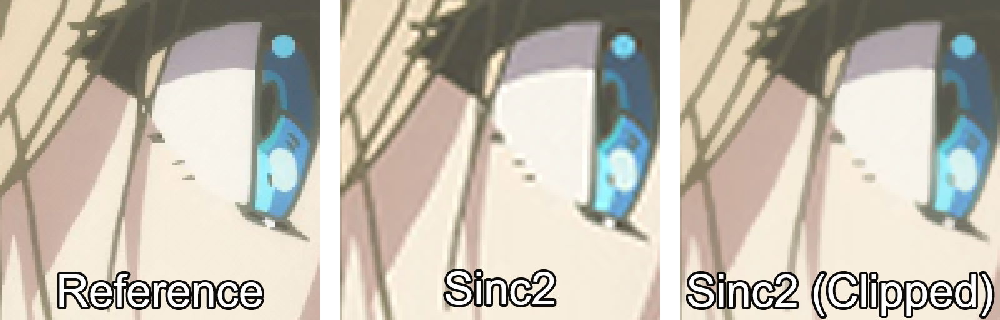

# GLSL Pixel Clipper

## Overview
This is a simple pixel clipper for mpv. You can use it alongside resampling filters to limit the amount of ringing after resampling.

~~The main difference between this and the built-in anti-ringing functionality is that this shader works with polar filters.~~ 
[Looks like polar AR is now supported in libplacebo](https://code.videolan.org/videolan/libplacebo/-/merge_requests/505), so these shaders shouldn't really be needed anymore.

Use the 12-tap variant for any filter with radius greater than 2.

You can also use an experimental weighted version that allows you to weight distant pixels differently, which is an idea salvaged from [here](https://code.videolan.org/videolan/libplacebo/-/merge_requests/505).

## Instructions
Add something like this to your mpv config:
```c
scale=ewa_lanczos
glsl-shader="path/to/shader/PixelClipper_12tap.glsl"
```

## Inputs
You can set the following parameters:
- `strength`: Controls the strength of the clipping. Accepts floats between `[0.0, 1.0]`, defaults to `1.0` (100% strength).

## Example

